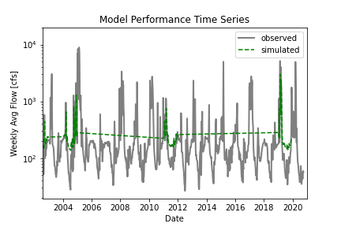

# **HAS Tools - Homework # **

### *Danielle Tadych -  m/d/2020*
___
## Grade

___

**Forecast Prediction Summary:**

*A summary of the AR model that you ended up building, including (1) what you are using as your prediction variables, (2) the final equation for your model and (3) what you used as your testing and training periods. In your discussion please include graphical outputs that support why you made the decisions you did with your model.*

In previous homeworks, I identified years where September flows were less than 60cfs (what we've seen this past month). I dubbed these "drought years".  So for my training data, I only used years that fit this criteria, which included 2002, 2004, 2011, 2019, and 2020.  My training period of this subset of data were the first 200 weeks and my final testing period were the last 43 weeks.

Final equation: y = 0.56x + 122.06
coefficient of determination: 0.31

**Model Performance:**

*Provide an analysis of your final model performance. This should include at least one graph that shows the historical vs predicted streamflow and some discussion of qualitatively how you think your model is good or bad.*

Despite using drought years for training data, the model tended to over predict observed flows.

**Forecast Prediction Summary:**

*Finally, provide discussion on what you actually used for your forecast. Did you use your AR model, why or why not? If not how did you generate your forecast this week?*

I did not use my AR model because I was not pleased with the R2 and the model over prediction.  Instead, like with the previous homeworks, I used 2019 as a base for my weekly and seasonal forecast.  I looked at the graphs below and also used the panda's describe feature to get monthly mins for each month and used those for my seasonal.  For the 1 and 2 week forecast, I checked the flow for the previous weeks and in the went with my gut.

