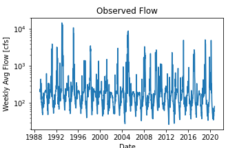
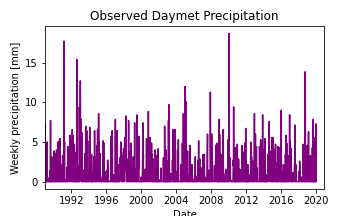

# **HAS Tools - Homework 9 **

### *Danielle Tadych -  10/26/2020*
Note: I'm not totally sure if I'm supposed to do a written portion this week since I think I was third on the two-week forecast competition but I figured I would submit just in case.
___

## Grade

___

1. *A brief summary of the how you chose to generate your forecast this week.*\
Because my model was garbage again, this week for my actual forecast I took the average of the flow in October this year and used that for my one week prediction.  Then for week 2 added it by the standard deviation.  For my seasonal forecast, I am once again  
2. *A description of the dataset you added
What is the dataset? Why did you choose it?
What location have you chosen?
Where did you get the data from?
What was your approach to accessing it?*\
The additional dataset I used was precipitation data from DayMet because I figured precipitation and flow would be closely correlated.  I was able to get a pixel with the same coordinates as the streamgauge station.  I did the same method as before regarding only using years where September flows went below 60 and did a linear regression.  The model was not great (R^2=0.04)

3. A plot of your additional time series along with your streamflow time series.

